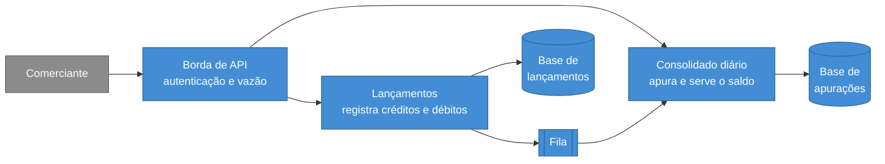

# Controle de fluxo de caixa diário

Sistema para um comerciante registrar os lançamentos do dia — créditos e débitos — e consultar o saldo diário consolidado.

São **dois serviços independentes**, e essa separação é a resposta ao requisito central da especificação: *o serviço de controle de lançamento não deve ficar indisponível se o consolidado diário cair*.



A **borda de API** do desenho é a única caixa acima que ainda não existe: ela pertence à camada de infraestrutura que não foi provisionada, e por isso não há controle de vazão em lugar nenhum hoje. Todo o resto — os dois serviços, as duas bases, a fila e o publicador — roda com um comando, mais abaixo.

**A seta que não existe é a mais importante do desenho.** Não há nenhuma ligando os dois serviços. Eles se comunicam apenas pela fila, cada um tem sua própria base, e nenhum consulta o outro em nenhum fluxo. É isso que faz o registro de lançamentos continuar funcionando com o consolidado inteiramente fora do ar.

## Como funciona

1. O comerciante registra um lançamento. O serviço valida as regras — valor positivo com no máximo duas casas, tipo conhecido, data de competência não futura — e persiste **o lançamento e o evento de integração na mesma transação**.
2. Confirmada a transação, o comerciante recebe a resposta. O registro está completo neste ponto, e nada adiante pode invalidá-lo.
3. Um processo separado publica os eventos pendentes na fila.
4. O serviço de Consolidado consome e **reivindica** o lançamento numa única operação, que devolve se a reivindicação foi obtida ou se ele já estava apurado; obtida, o valor entra no saldo do seu dia de competência.
5. A consulta do saldo lê uma apuração já pronta, sem agregar lançamentos — o custo não cresce com o volume do dia.

O passo 2 é a fronteira da garantia síncrona. Tudo depois dele é assíncrono e recuperável: se o Consolidado estiver fora do ar, as mensagens ficam retidas e o saldo converge no restabelecimento.

## Como rodar localmente

Requisito: **Docker** com Compose. Um comando sobe os dois serviços, o banco e a fila:

```bash
cd back && docker compose up -d --build
```

A interface fica em http://localhost:8080 — duas telas, uma para registrar e listar lançamentos e outra para o saldo do dia.

O ambiente local substitui os serviços gerenciados por equivalentes em contêiner — PostgreSQL no lugar do Aurora DSQL, LocalStack no lugar do SQS. A infraestrutura é ciente do motor, e essa divergência está registrada na [ADR 0006](docs/decisoes/0006-persistencia-em-aurora-dsql-com-ef-core.md).

| Serviço | Endereço | OpenAPI |
|---|---|---|
| Lançamentos | http://localhost:8081 | `/openapi/v1.json` |
| Consolidado | http://localhost:8082 | `/openapi/v1.json` |

Cada serviço expõe `/health/live` e `/health/ready`. A vivacidade não consulta dependência, de modo que indisponibilidade de banco não vire reinício de contêiner sadio.

Registre um lançamento no primeiro serviço:

```bash
curl -X POST http://localhost:8081/api/v1/entries -H 'content-type: application/json' -d '{"type":"credit","amount":150.00,"competenceDate":"2026-08-20","description":"venda balcao"}'
```

E leia o saldo no segundo:

```bash
curl http://localhost:8082/api/v1/daily-balances/2026-08-20
```

O saldo aparece **alguns segundos depois** do registro, não instantaneamente. Isso é o desenho, não latência acidental: a resposta do primeiro serviço já confirma a persistência do lançamento, e a apuração converge pela fila. É o que mantém o registro disponível quando o Consolidado está fora do ar.

Para derrubar tudo, incluindo os volumes:

```bash
cd back && docker compose down -v
```

### Autenticação

As rotas de negócio exigem credencial; as verificações de saúde são as únicas abertas, e não expõem dado de negócio. O desenho valida no gateway **e** no próprio serviço — a razão da redundância está na emenda da [ADR 0007](docs/decisoes/0007-borda-com-api-gateway-cognito-e-fargate.md). Como o gateway não está provisionado, a verificação que existe hoje é a do serviço, e é ela que os testes exercitam.

A verificação **falha fechada**: sem `Authentication:Authority` configurado o serviço recusa-se a iniciar, em vez de subir aberto. O ambiente local sobe com `Authentication__Mode: Disabled`, declarado no `docker-compose.yml`, para que os comandos acima funcionem sem um provedor de identidade na máquina. É o único modo de operar sem credencial, ele é explícito, e o serviço recusa-o fora do ambiente de desenvolvimento.

A configuração do ambiente local — motor, banco, usuário e senha — vive no `docker-compose.yml` e num `appsettings.Development.json` que não é publicado. O `appsettings.json` que vai dentro da imagem não carrega credencial alguma, e seus padrões são os de nuvem: motor gerenciado e credencial exigida.

O comportamento com credencial ausente, expirada e com assinatura inválida é coberto por testes contra o servidor HTTP real, em `CashFlow.IntegrationTests`, e esses rodam sem infraestrutura.

### Testes

Requisito: **.NET SDK 10** ([download](https://dotnet.microsoft.com/download)). A versão está fixada em `back/global.json`.

```bash
cd back && dotnet test
```

Isso restaura, compila e executa as suítes. A saída esperada termina em `falhou: 0`.

As regras de negócio rodam sem banco, sem fila e sem rede — é uma decisão de projeto, não uma limitação. A camada de domínio não conhece persistência, e é isso que mantém a suíte rápida o bastante para rodar a cada alteração.

Seis testes de integração são **ignorados** sem acesso a um motor real, e o comando acima reporta isso. Eles verificam a semântica de concorrência do banco — conflito otimista, reivindicação atômica, ausência de atualização perdida — que nenhum banco local reproduz. Para executá-los:

```bash
cd back && LEDGER_DB_HOST=<host> CONSOLIDATION_DB_HOST=<host> dotnet test
```

Para ver as verificações de dependência que rodam junto da construção:

```bash
cd back && dotnet list package --vulnerable --include-transitive
```

Elas rodam na construção local e na integração contínua, que executa construção e suíte a cada envio. O que ainda fica descoberto está declarado em [RNF-006](docs/requisitos/transversais/rnf-006-integridade-da-cadeia-de-dependencias.md).

## Estado atual

O trabalho é faseado, e este repositório concluiu a fase 5 de 6, com **140 testes**. O que existe hoje:

| Camada | Estado |
|---|---|
| Documentação de arquitetura | pronta — requisitos, vistas C4, oito decisões registradas |
| Domínio e casos de uso dos dois serviços | prontos |
| Persistência e mensageria | prontas — migrações, registro de saída, publicador e consumidor |
| API | pronta — dois serviços em execução local verificada de ponta a ponta |
| Autenticação | pronta — verificada no serviço, falhando fechada |
| Interface web | pronta — duas telas em HTML, CSS e JavaScript, sem dependência nem etapa de construção |
| Observabilidade | registros estruturados com identificador de correlação e verificações de saúde; **nenhuma métrica** |
| Infraestrutura | camada de persistência provisionada; borda, rede, execução e fila **não estão no Terraform** |

A camada de persistência foi provisionada de verdade numa conta AWS antes de qualquer código depender dela, e essa validação derrubou quatro suposições do desenho — está em [ADR 0006](docs/decisoes/0006-persistencia-em-aurora-dsql-com-ef-core.md).

O andamento detalhado está em [plano de execução](docs/plano-de-execucao.md).

## Estrutura

```
back/    dois serviços em .NET 10
front/   interface web — HTML, CSS e JavaScript sobre nginx
infra/   Terraform — apenas a camada de persistência
docs/    documentação de projeto
```

## Documentação

Comece por [docs/index.md](docs/index.md), que organiza a leitura por objetivo. Os atalhos mais úteis:

| Se você quer | Leia |
|---|---|
| Entender a solução em cinco minutos | [vista de contexto](docs/arquitetura/vistas/c1-contexto.md) e [de contêineres](docs/arquitetura/vistas/c2-conteineres.md) |
| Avaliar as decisões e o rationale | [registros de decisão](docs/decisoes/index.md) |
| Conferir a aderência à especificação | [catálogo de requisitos](docs/requisitos/index.md) |
| Entender o que ficou de fora, e por quê | [escopo e limites](docs/escopo-e-limites.md) |
| Ver como os requisitos não funcionais são demonstrados | [estratégia de testes](docs/qualidade/estrategia-de-testes.md) |

A documentação segue a **ISO/IEC/IEEE 42010** na descrição arquitetural, com as vistas no modelo **C4**; a **ISO/IEC/IEEE 29148** no catálogo de requisitos, em sintaxe EARS; e a **ISO/IEC 25010** na classificação dos não funcionais.

## Sobre o escopo

A especificação pede dois serviços, C#, testes, boas práticas, README e documentação no repositório. O front-end e a infraestrutura como código **não são pedidos** — entram como exceções declaradas, nomeadas como exceções em [escopo e limites](docs/escopo-e-limites.md), que também registra o que foi deliberadamente omitido e o critério que sustenta cada omissão.

Registrar a omissão com o critério que a sustenta é o que separa uma decisão de um esquecimento.
