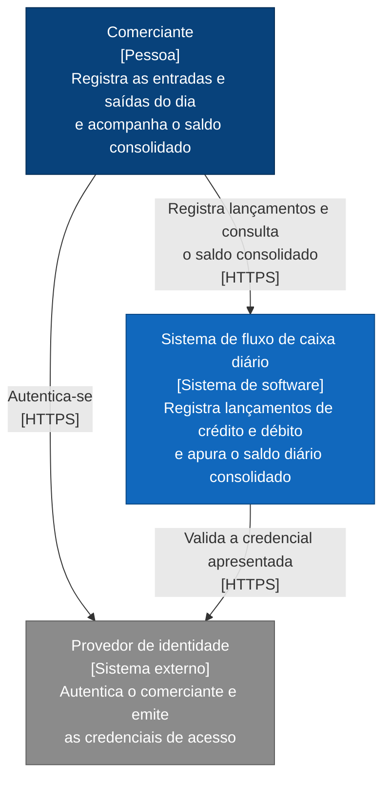

# Vista de contexto

## Preocupações enquadradas

- **P2** — o registro de lançamentos continua funcionando quando a apuração falha.
- **P5** — o acesso é autenticado e os dados protegidos em trânsito.

## Diagrama

## Descrição

O sistema tem **um** ator humano. Essa constatação é a primeira decisão de escopo e sustenta várias omissões documentadas em [escopo e limites](../../escopo-e-limites.md): não há hierarquia de permissões porque não há segundo papel, e não há particionamento por cliente porque não há segundo cliente.

A autenticação é delegada a um provedor de identidade externo. O sistema não armazena senha, não implementa recuperação de acesso e não gerencia ciclo de vida de credencial. Ele verifica a credencial apresentada e extrai dela a identidade do portador.

## Fronteira do sistema

| Dentro | Fora |
|---|---|
| Registro e consulta de lançamentos | Autenticação e gestão de identidade |
| Apuração e consulta do saldo diário | Conciliação bancária e meios de pagamento |
| Interface de uso | Emissão de documentos fiscais |

Os itens da coluna direita não são lacunas. São fronteiras, e as que poderiam ser confundidas com omissão estão tratadas em [evolucao/roadmap.md](../../evolucao/roadmap.md).

## Decomposição

A vista seguinte, [C2 — Contêineres](c2-conteineres.md), abre a caixa preta e mostra que ela contém dois serviços independentes, e por quê.
