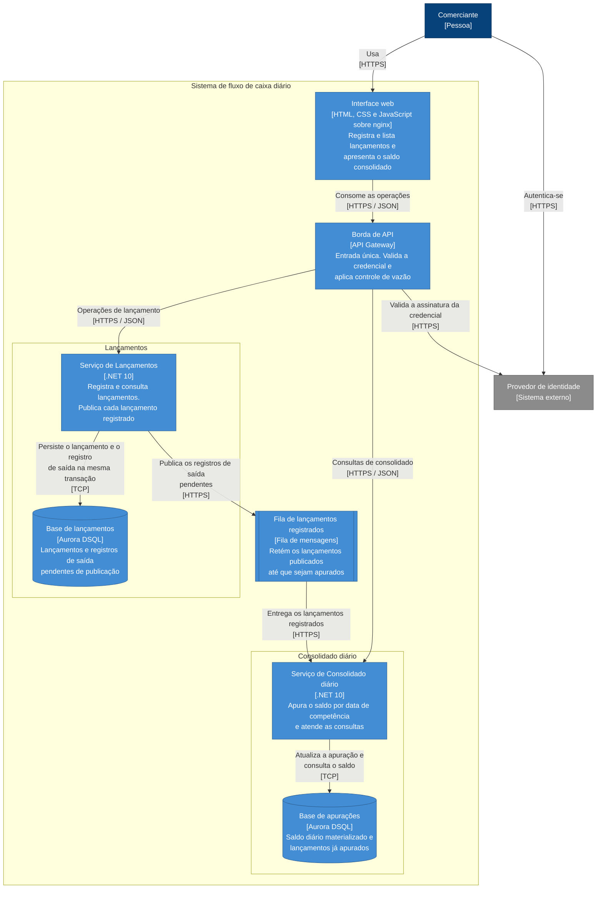

# Vista de contêineres

> Esta vista descreve o **desenho**. O que já existe em código está registrado em [plano de execução](../../plano-de-execucao.md); o restante é projeto a ser alcançado pelas fases seguintes.

## Preocupações enquadradas

- **P1** — o saldo apurado corresponde aos lançamentos registrados.
- **P2** — o registro de lançamentos continua funcionando quando a apuração falha.
- **P3** — a consulta do consolidado absorve o pico de dias de movimento.
- **P4** — os dois serviços evoluem e são implantados de forma independente.
- **P6** — o comportamento em execução é diagnosticável.

## Diagrama

## A relação que não existe

A ausência mais importante do diagrama é a seta que **não** liga o Serviço de Lançamentos ao Serviço de Consolidado. Não há nenhuma, em nenhuma direção, em nenhum fluxo.

É essa ausência que realiza [RNF-001](../../requisitos/transversais/rnf-001-isolamento-de-falha-entre-servicos.md). Qualquer chamada síncrona entre os dois — mesmo uma consulta aparentemente inofensiva — acoplaria a disponibilidade do registro à disponibilidade da apuração, e o requisito deixaria de ser atendido no instante em que fosse introduzida.

A comunicação acontece exclusivamente pela fila, e a fila é assíncrona nos dois sentidos que importam: o Lançamentos não espera o consumo, e o Consolidado não solicita a produção. O teste de arquitetura descrito em [estratégia de testes](../../qualidade/estrategia-de-testes.md) falha se um serviço passar a referenciar o outro. Ele detecta a violação declarada — uma dependência de compilação — e não detecta uma chamada por endereço construído em tempo de execução. A proteção é parcial, e está declarada como parcial.

## Contrato do evento de integração

É o único contrato que atravessa a fronteira entre os dois serviços, e portanto o único acoplamento que os liga. Ele é declarado aqui por inteiro.

| Campo | Tipo | Origem | Para que o consumidor precisa |
|---|---|---|---|
| `entryId` | identificador único | atribuído no registro | Detectar reprocessamento. É a chave de idempotência |
| `type` | inteiro — `1` crédito, `2` débito | do lançamento | Determinar o sinal na apuração |
| `amount` | decimal com duas casas | do lançamento | Compor os totais do dia |
| `competenceDate` | data sem horário | do lançamento | Escolher a apuração a atualizar |
| `recordedAt` | instante em UTC | do lançamento | Ordenação e diagnóstico |
| `correlationId` | identificador da requisição | do contexto da requisição | Ligar o registro à apuração nos registros de execução |
| `contractVersion` | inteiro | fixo na publicação | Permitir evolução sem quebrar o consumidor |

Os nomes são os do contrato serializado, e é por eles que a mensagem trafega. O tipo do lançamento viaja como inteiro porque o serializador emprega a representação numérica da enumeração; na superfície HTTP o mesmo tipo aparece como `credit` ou `debit`, conforme o [contrato da API](../contrato-de-api.md).

O evento carrega **tudo o que a apuração precisa**. O Consolidado nunca consulta o Lançamentos para completar a informação — se precisasse, a proibição de chamada síncrona de [RNF-001](../../requisitos/transversais/rnf-001-isolamento-de-falha-entre-servicos.md) estaria desfeita, e o isolamento de falha com ela.

Essa é a razão de `processed_entry` guardar apenas o fato da incorporação, e não o valor: o valor chega no evento, é somado ao total do dia, e o total é a única representação dele do lado do Consolidado.

O contrato é a fronteira de compatibilidade. Acrescentar campo é compatível; remover ou mudar o significado de um campo existente exige incremento de `contractVersion` e um consumidor que aceite as duas versões durante a transição.

## Bases de dados separadas

Cada serviço tem a sua base. Não há esquema compartilhado, nem consulta de um serviço a tabela do outro.

A separação existe por P4: um esquema compartilhado tornaria toda migração de estrutura uma coordenação entre os dois serviços, e a independência de implantação seria nominal. Também serve a P2, porque uma contenção de recursos na base de um não se propaga ao outro.

O custo é a duplicação da informação do lançamento — ele existe integralmente na base de Lançamentos e de forma agregada na base de apurações. Essa duplicação é intencional, e é o que permite que a consulta do consolidado não toque a base de lançamentos.

Cada base é um agrupamento de persistência próprio, e não um recorte lógico dentro de um compartilhado. Com isso, consulta ou transação cruzada entre os dois serviços não é apenas proibida por convenção: é impossível, porque não há caminho. O motivo da escolha e a alternativa descartada estão em [ADR 0006](../../decisoes/0006-persistencia-em-aurora-dsql-com-ef-core.md).

## Caminho de um lançamento

1. A interface web envia o lançamento à borda, apresentando a credencial.
2. A borda valida a assinatura da credencial e encaminha ao Serviço de Lançamentos.
3. O serviço valida as invariantes e persiste, **na mesma transação**, o lançamento e o registro de saída correspondente.
4. Confirmada a transação, o comerciante recebe a resposta. O registro está completo neste ponto.
5. Um processo separado lê os registros de saída pendentes e os publica na fila.
6. O Serviço de Consolidado consome a mensagem e **reivindica** o lançamento numa única operação, que devolve se a reivindicação foi obtida ou se ele já estava apurado; obtida, o valor entra no saldo do dia de competência. Por que não são duas operações está na [vista de componentes](c3-componentes.md).

O passo 4 é a fronteira da garantia síncrona. Tudo depois dele é assíncrono e recuperável; nada depois dele pode invalidar o lançamento já confirmado.

## Por que o registro de saída existe

Ele fecha a janela entre a confirmação da transação e a publicação na fila, na qual um lançamento confirmado poderia nunca ser apurado — divergindo o saldo de forma permanente e silenciosa. O rationale completo, com as alternativas descartadas, está em [ADR 0003](../../decisoes/0003-outbox-transacional-e-consumo-idempotente.md).

## Comportamento sob indisponibilidade

| Componente indisponível | Efeito no registro de lançamentos | Efeito na consulta do consolidado |
|---|---|---|
| Serviço de Consolidado | Nenhum | Consulta indisponível. Apuração retomada no restabelecimento |
| Base de apurações | Nenhum | Consulta indisponível. Mensagens retidas na fila |
| Fila | Nenhum. Registros de saída acumulam e são publicados depois | Saldo desatualizado, converge no restabelecimento |
| Serviço de Lançamentos | Registro indisponível | Nenhum. Consultas seguem sendo atendidas |
| Base de lançamentos | Registro indisponível | Nenhum |

Nenhuma linha da coluna central, exceto as duas últimas, contém efeito. É essa coluna que demonstra [RNF-001](../../requisitos/transversais/rnf-001-isolamento-de-falha-entre-servicos.md).

## Capacidade de leitura

A consulta do saldo é atendida pela leitura de uma apuração já materializada. O custo da consulta não cresce com o volume de lançamentos do dia, o que torna o comportamento sob o pico de [RNF-002](../../requisitos/transversais/rnf-002-capacidade-de-consulta-do-consolidado.md) previsível: escalar a leitura é adicionar réplicas do serviço, não otimizar uma agregação.

O Serviço de Consolidado não mantém estado local entre requisições, e por isso admite réplicas sem coordenação. O consumidor da fila roda dentro do mesmo contêiner; a idempotência da apuração ([RF-CON-002](../../requisitos/consolidado/rf-consolidado-002-ignorar-lancamento-ja-apurado.md)) é o que permite que várias réplicas consumam em paralelo sem duplicar saldo.

## Decomposição

A vista seguinte, [C3 — Componentes](c3-componentes.md), abre os dois serviços e mostra a organização interna de cada um.
