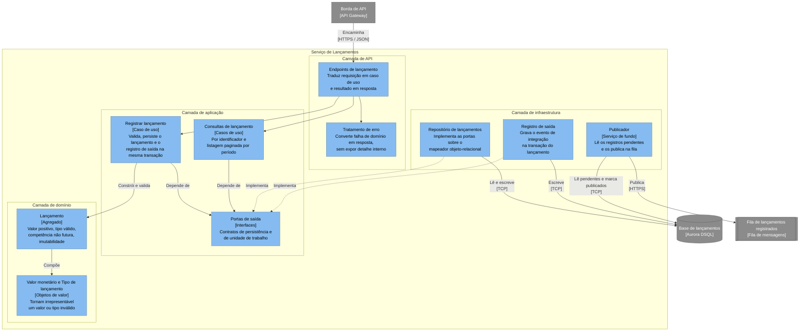
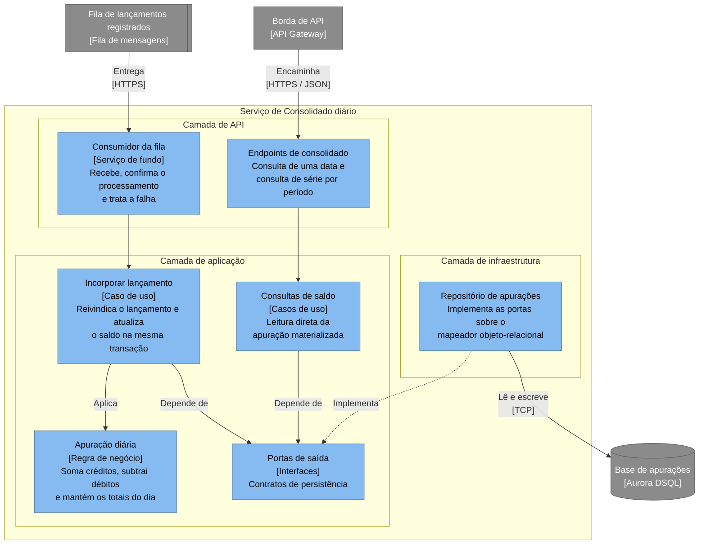

# Vista de componentes

> Esta vista descreve o **desenho**. O que já existe em código está registrado em [plano de execução](../../plano-de-execucao.md); o restante é projeto a ser alcançado pelas fases seguintes.

## Preocupações enquadradas

- **P1** — o saldo apurado corresponde aos lançamentos registrados.
- **P7** — o custo de entender e alterar o sistema é proporcional ao seu tamanho.

## Regra de dependência

Nos dois serviços as dependências apontam para dentro. A camada de domínio não conhece persistência, transporte nem apresentação; a de aplicação declara portas e a de infraestrutura as implementa. A regra é verificada por teste automatizado, não por convenção — ver [estratégia de testes](../../qualidade/estrategia-de-testes.md).

## Serviço de Lançamentos

### Onde as invariantes vivem

As invariantes de [RF-LAN-001](../../requisitos/lancamentos/rf-lancamentos-001-registrar-lancamento.md) são protegidas no ato da construção, e o agregado não pode existir em estado inválido: não há construtor público, nem propriedade que permita alterar o valor depois.

A validação do valor é delegada ao objeto de valor monetário, que rejeita valor não positivo, escala acima de duas casas e valor acima do teto suportado pela coluna. As demais — tipo conhecido, competência não futura, limite de tamanho da descrição — vivem no agregado.

Há um segundo caminho de construção, usado apenas para reidratar um lançamento já persistido. Ele não revalida as regras de negócio, porque um lançamento gravado já as satisfez, mas rejeita estado corrompido: identificador vazio, tipo desconhecido ou descrição acima do limite. Corrupção de linha deve falhar alto, não virar saldo silenciosamente errado.

Essa escolha tem consequência prática nos testes. As regras de negócio são exercitadas sem banco, sem fila e sem rede, porque o agregado não depende de nada disso. É o que torna a suíte unitária rápida o bastante para ser executada a cada alteração.

### Concorrência do publicador

O serviço roda replicado, e cada réplica hospeda um publicador lendo a mesma tabela de registros pendentes. Sem coordenação, todas leriam o mesmo lote e publicariam a mesma mensagem.

O motor de persistência escolhido não oferece bloqueio pessimista, então a coordenação não pode usar leitura com trava. Cada publicador **reivindica** um lote por atualização condicional — marca as linhas como suas apenas se ainda não reivindicadas — e só publica o que conseguiu reivindicar. Sob controle de concorrência otimista, reivindicações simultâneas conflitam, uma vence e as demais tentam o lote seguinte.

A reivindicação expira em **cinco minutos**, para que um publicador que morra entre reivindicar e publicar não deixe registros presos. Reivindicação expirada é o sinal de publicador morto, e é o que [metas e métricas](../../qualidade/metas-e-metricas.md) declara que deveria ser alarmado — nenhum alarme existe hoje.

Reivindicar não basta se todas as réplicas disputarem as **mesmas** linhas. Lendo os pendentes com o mesmo critério e a mesma ordenação, cada réplica pediria exatamente o mesmo lote, todas conflitariam, uma venceria e as demais recomeçariam sobre o lote seguinte — igualmente idêntico. A vazão de publicação não cresceria com réplicas; degradaria.

O espaço de reivindicação **já foi** particionado por um tempo — cada registro carregava uma partição derivada do seu identificador, e cada publicador varria um subconjunto sorteado. O mecanismo foi removido, e vale registrar por quê, porque o erro é instrutivo.

Ele existia para réplicas disputarem linhas diferentes. Mas a reivindicação por atualização condicional já resolve a disputa: quem perde não carimba, e segue. Particionar não acrescentava garantia — acrescentava latência. Varrer um quarto das partições por rodada dá um quarto de chance de alcançar uma mensagem a cada ciclo, e o atraso de convergência medido tinha mediana de seis segundos e cauda acima de trinta, contra a meta de cinco em [metas e métricas](../../qualidade/metas-e-metricas.md). Para um comerciante com dezenas de lançamentos por dia, a disputa que o particionamento evitava nunca existiu.

O publicador varre as pendentes direto. O intervalo entre varreduras carrega variação aleatória, para que reinícios simultâneos não sincronizem as réplicas.

Duplicidade continua possível: um publicador pode publicar e morrer antes de marcar como publicado. Isso é aceito por desenho — a incorporação é idempotente, e uma publicação repetida não altera o saldo. A reivindicação existe para tornar a duplicidade excepcional, não para eliminá-la; eliminá-la exigiria transação distribuída, descartada em [ADR 0003](../../decisoes/0003-outbox-transacional-e-consumo-idempotente.md).

### Modelo de dados

| Tabela | Colunas relevantes | Observações |
|---|---|---|
| `entry` | identificador, tipo, valor, data de competência, descrição, data de registro | Somente inserção. Índice por data de competência para atender a listagem por período |
| `outbox_message` | identificador, identificador do lançamento, tipo do evento, conteúdo, data de criação, data de publicação, reivindicado por, reivindicado em, contagem de tentativas | `data de publicação` nula indica pendente. As colunas de reivindicação coordenam os publicadores, e a contagem de tentativas separa o registro que falha sempre do que apenas atrasou. Índice comum sobre a coluna de publicação: o motor não suporta índice parcial, conforme [ADR 0006](../../decisoes/0006-persistencia-em-aurora-dsql-com-ef-core.md) |

## Serviço de Consolidado diário

### Por que este serviço tem menos camadas

A regra deste serviço é uma agregação idempotente: dado um lançamento ainda não apurado, somar seu valor ao total do seu dia. Não há entidade com ciclo de vida a proteger nem invariante que sobreviva a mais de uma linha de código, e por isso a apuração vive na camada de aplicação, como componente próprio e testável isoladamente. O argumento está em [ADR 0005](../../decisoes/0005-clean-architecture-e-ddd-tatico.md).

### Idempotência e transação

A idempotência **não** é obtida consultando se o lançamento já foi apurado e depois marcando-o. Consultar e marcar são duas operações, e sob concorrência otimista dois consumidores leem "ainda não apurado", ambos prosseguem, e o conflito só aparece no *commit* — o consumidor trataria um reprocessamento legítimo como erro e mandaria a mensagem para a fila de exceção.

Em vez disso, a incorporação **reivindica** o lançamento numa única operação, que devolve se a reivindicação foi obtida ou se ele já estava apurado. É a chave primária de `processed_entry` que decide, e ela decide de uma vez.

Reivindicação e atualização do saldo ocorrem na **mesma transação**. Uma falha entre as duas desfaz as duas, e o lançamento volta a estar disponível para reprocessamento.

O consumidor só confirma a mensagem depois da confirmação da transação. Uma falha antes disso resulta em reentrega, que é inofensiva sob esse mecanismo; uma confirmação antes disso resultaria em perda, que não é.

Conflito de concorrência no *commit* é **transitório**, e não indica mensagem defeituosa: ele é refeito com espera crescente, sem consumir tentativa de entrega, conforme [metas e métricas](../../qualidade/metas-e-metricas.md).

### Modelo de dados

| Tabela | Colunas relevantes | Observações |
|---|---|---|
| `daily_balance` | data de competência, total de créditos, total de débitos, quantidade de lançamentos, atualizado em | Chave primária é a data de competência. Uma linha por dia. **O saldo não é coluna**: é a diferença entre os dois totais, calculada na leitura, porque uma terceira coluna que precisa concordar com as outras duas é uma oportunidade de divergir |
| `processed_entry` | identificador do lançamento, data de competência, apurado em | Chave primária é o identificador do lançamento. É o que torna a incorporação idempotente |

A tabela `processed_entry` é a materialização de [RF-CON-002](../../requisitos/consolidado/rf-consolidado-002-ignorar-lancamento-ja-apurado.md). Ela não guarda o valor do lançamento, apenas o fato de já ter sido incorporado — o saldo é a única representação do valor, e mantê-lo em dois lugares criaria uma segunda fonte de verdade a divergir.

## Decomposição

O nível de código do C4 não é produzido. A justificativa está na [descrição arquitetural](../descricao-arquitetural.md).
