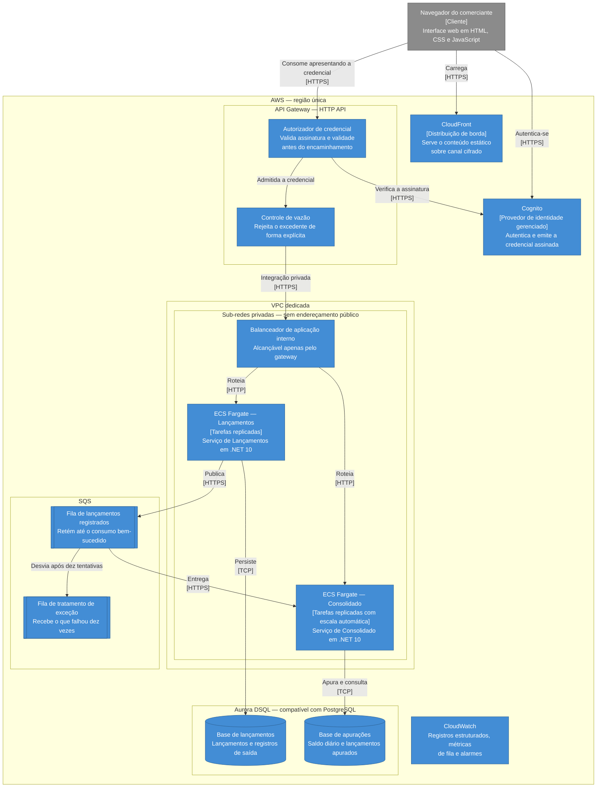

# Vista de implantação

> Esta vista descreve o **desenho**. O que já existe em código está registrado em [plano de execução](../../plano-de-execucao.md); o restante é projeto a ser alcançado pelas fases seguintes.

## Preocupações enquadradas

- **P2** — o registro de lançamentos continua funcionando quando a apuração falha.
- **P3** — a consulta do consolidado absorve o pico de dias de movimento.
- **P5** — o acesso é autenticado e os dados protegidos em trânsito e em repouso.
- **P6** — o comportamento em execução é diagnosticável.

O propósito desta vista é tornar verificável o que as vistas anteriores afirmam. Um desenho que declara escalabilidade horizontal e isolamento de falha precisa poder ser confrontado com os recursos que os realizam.

## Diagrama

## Superfície de exposição

Só dois recursos são alcançáveis pela internet: a distribuição de borda que serve a interface web e o gateway de API. Tudo o mais vive em sub-redes privadas, sem endereçamento público.

O balanceador é interno e aceita tráfego apenas do gateway, por integração privada.

Essa restrição é a barreira de rede entre o sistema e um alcance direto às tarefas a partir de qualquer carga de trabalho dentro da rede. Ela é uma **condição a garantir**, não uma propriedade que decorra sozinha da topologia. Desde a emenda da [ADR 0007](../../decisoes/0007-borda-com-api-gateway-cognito-e-fargate.md) ela deixou de ser a única barreira: o serviço alcançado por dentro ainda exige credencial válida.

> O grupo de segurança do balanceador interno aceita tráfego exclusivamente da interface de rede da integração privada do gateway. Nenhuma outra origem, dentro ou fora da rede, alcança as tarefas.

Garantida essa condição, não existe caminho de rede que alcance uma tarefa sem atravessar o gateway, e portanto não existe caminho que contorne a validação. É o que realiza o critério de [RNF-003](../../requisitos/transversais/rnf-003-seguranca-de-acesso-e-transporte.md) segundo o qual os serviços não são endereçáveis diretamente — e é um item de verificação da infraestrutura, não uma afirmação de desenho.

## Onde cada controle de segurança é aplicado

| Controle | Onde | Requisito |
|---|---|---|
| Autenticação da requisição | Autorizador do gateway, antes do encaminhamento | RNF-003 |
| Cifra em trânsito | Distribuição de borda e gateway, com redirecionamento do canal não cifrado | RNF-003 |
| Cifra em repouso | Mecanismo do serviço gerenciado de persistência e da fila | RNF-003 |
| Isolamento de rede | Sub-redes privadas, sem rota de entrada da internet | RNF-003 |
| Credencial de acesso à base | Identidade da carga de trabalho, com credencial de curta duração derivada, sem senha estática | RNF-003 |
| Controle de vazão | Gateway, rejeitando o excedente de forma explícita | RNF-002 |
| Integridade das dependências | Construção do artefato, antes de existir execução | RNF-006 |

A **política** de acesso é aplicada uma vez, na borda: controle de vazão, terminação do canal cifrado e quais rotas são públicas. A **verificação** da credencial acontece duas vezes — na borda e no serviço. A emenda da [ADR 0007](../../decisoes/0007-borda-com-api-gateway-cognito-e-fargate.md) registra a razão: sem verificação no serviço, o ambiente local sobe sem autenticação alguma e os ensaios que o RNF-003 exige ficam fora do alcance da suíte. O que não se duplica é a política, e uma verificação redundante que discorde da outra rejeita a requisição em vez de admiti-la.

## Como a escala é obtida

O Serviço de Consolidado é o que enfrenta o pico de [RNF-002](../../requisitos/transversais/rnf-002-capacidade-de-consulta-do-consolidado.md). Ele escala por número de tarefas, com a política de escala reagindo à quantidade de requisições por tarefa.

Isso só funciona porque o serviço não mantém estado local entre requisições: qualquer tarefa responde qualquer consulta com o mesmo resultado. Adicionar uma tarefa adiciona capacidade sem coordenação, sem afinidade de sessão e sem aquecimento.

O consumo da fila escala junto, por rodar no mesmo processo. A idempotência de [RF-CON-002](../../requisitos/consolidado/rf-consolidado-002-ignorar-lancamento-ja-apurado.md) é o que torna isso seguro para a **correção**: várias tarefas consumindo a mesma fila podem receber a mesma mensagem, e o saldo final é o mesmo.

### A tensão entre escalar a leitura e apurar

Escalar por leitura tem um efeito colateral que precisa estar declarado: cada tarefa nova traz junto mais um consumidor, e todos os consumidores atualizam a **mesma linha** — a apuração do dia corrente, cuja chave é a data de competência. Sob controle de concorrência otimista, sem bloqueio pessimista, a taxa de conflito nessa linha cresce com a concorrência. Levado ao extremo, adicionar tarefas para atender leitura reduziria a vazão de apuração.

A tensão não é binding neste sistema, e o motivo é o volume: há **um** comerciante, e o fluxo de escrita é de dezenas de lançamentos por dia, não por segundo. Seis consumidores disputando uma linha atualizada algumas dezenas de vezes ao dia praticamente não colidem. O que torna o pico de 50 requisições por segundo administrável é ele ser de **leitura**, e leitura não disputa a linha.

O limite foi medido, não estimado: com **oito** incorporações simultâneas na mesma data, um orçamento de cinco tentativas não converge, e doze converge. O número está em [ADR 0006](../../decisoes/0006-persistencia-em-aurora-dsql-com-ef-core.md), e é ele que define quando esta tensão deixa de ser teórica.

Três medidas mantêm a margem, e a primeira já é decisão:

- a concorrência de consumo é limitada a uma mensagem por vez por tarefa, de modo que a contenção cresça com o número de tarefas e não com o produto de tarefas por *threads*;
- a política de escala observa a leitura, mas o **acúmulo da fila** é alarmado à parte, para que uma degradação de apuração não fique escondida atrás de uma métrica de leitura saudável;
- se o volume de escrita crescer a ponto de o conflito aparecer, o remédio é separar o consumidor em unidade própria de implantação, com escala por idade da mensagem mais antiga. Isso reabre a decisão de [ADR 0001](../../decisoes/0001-decomposicao-em-dois-servicos.md) de não criar uma terceira unidade, e a condição que a reabre está registrada em [roadmap](../../evolucao/roadmap.md).

Sob sobrecarga além da capacidade provisionada, o controle de vazão do gateway rejeita o excedente de forma explícita, pelas razões registradas em [ADR 0007](../../decisoes/0007-borda-com-api-gateway-cognito-e-fargate.md).

## Dimensionamento

A carga da especificação é modesta, e dizê-lo é parte da resposta. Cinquenta requisições por segundo de leitura de uma única linha indexada não é carga que exija dimensionamento elaborado.

| Componente | Dimensionamento inicial | Base |
|---|---|---|
| Tamanho da tarefa | 0,5 vCPU / 1 GiB | A ser confirmado pelo ensaio. Sem o tamanho, contar tarefas não é dimensionar |
| Tarefas do Consolidado | 2 | **Cada uma dimensionada para o pico inteiro.** A segunda tolera a perda de uma, não divide a carga |
| Tarefas do Lançamentos | 2 | Mesmo raciocínio. A carga de escrita é menor ainda |
| Teto de escala do Consolidado | 6 tarefas | Margem de três vezes sobre o pico da especificação |
| Limite de vazão no gateway | 100 req/s | Duas vezes o pico, para absorver rajada sem rejeitar tráfego legítimo |
| Concorrência de consumo | 1 mensagem por tarefa | Mantém a contenção proporcional ao número de tarefas |

### Por que o mínimo atende o pico sozinho

O caminho da escala automática — métrica de um minuto, alarme de três pontos, provisionamento da tarefa, obtenção da imagem, partida do processo e duas verificações de saúde — leva tipicamente de quatro a seis minutos. O ensaio de [RNF-002](../../requisitos/transversais/rnf-002-capacidade-de-consulta-do-consolidado.md) é uma rampa seguida de dez minutos de patamar: quando a capacidade adicional chegar, o pico já terá passado a maior parte.

Isso obriga a inverter o raciocínio comum. **O dimensionamento mínimo precisa absorver o pico inteiro**; a escala automática é margem para erro de estimativa e para picos acima do previsto, não o mecanismo que atende o requisito. Foi por isso que o autoescalonamento saiu da tabela do que foi construído em [escopo e limites](../../escopo-e-limites.md): ele nunca foi derivado do requisito, e além disso é desenho desta vista, não recurso provisionado.

Durante o pico, uma implantação não pode reduzir a capacidade: a atualização mantém a contagem saudável em cem por cento e o disjuntor reverte automaticamente.

A política de escala existe para o caso de a estimativa estar errada e para picos acima do previsto, não porque a carga declarada a exija. Provisionar mais do que isso desde o início seria dimensionar para um problema que a especificação não descreve.

Os números são estimativa de partida, a serem confrontados com o ensaio de carga de [estratégia de testes](../../qualidade/estrategia-de-testes.md). Um dimensionamento que não é revisado contra medição é chute com tabela.

## Isolamento de falha na infraestrutura

Os dois serviços rodam em agrupamentos separados, com tarefas, políticas de escala e bases distintas.

O que **é** compartilhado, e portanto é destino comum, precisa estar nomeado por inteiro — uma lista incompleta aqui é pior do que nenhuma, porque induz confiança:

| Recurso compartilhado | Efeito de uma falha ou saturação |
|---|---|
| Gateway de API | Os dois serviços ficam inalcançáveis. Contrapartida aceita em [ADR 0007](../../decisoes/0007-borda-com-api-gateway-cognito-e-fargate.md) |
| Limite de vazão do gateway | Aplicado por rota, e não por estágio, justamente para que uma rajada de escrita não consuma o orçamento de leitura do outro serviço |
| Balanceador interno e integração privada | Caminho único de entrada. Uma alteração errada de escuta alcança os dois |
| Cota de vCPU da conta para contêineres sem servidor | Dois agrupamentos não compram isolamento aqui: o limite é da conta |
| Rede e saída para a internet | Compartilhadas. A saída é o ponto mais fácil de virar destino comum por acidente |

A persistência **não** está nesta lista, e é a única peça de estado do sistema: cada serviço tem seu próprio agrupamento, pelas razões em [ADR 0006](../../decisoes/0006-persistencia-em-aurora-dsql-com-ef-core.md).

A persistência é o ponto onde essa afirmação mais facilmente se perderia: as duas bases são agrupamentos independentes, não recortes de um compartilhado. Um agrupamento compartilhado seria a única peça do sistema capaz de derrubar os dois serviços ao mesmo tempo — ver [ADR 0006](../../decisoes/0006-persistencia-em-aurora-dsql-com-ef-core.md).

A fila é o ponto de desacoplamento. Ela retém as mensagens enquanto o consumidor estiver fora do ar e as entrega no restabelecimento, o que realiza [RNF-004](../../requisitos/transversais/rnf-004-recuperabilidade-e-convergencia-do-consolidado.md). Mensagens que falham dez vezes são desviadas para a fila de tratamento de exceção, de modo que uma mensagem individualmente defeituosa não bloqueie o processamento das demais. Dez é o valor efetivamente configurado na política de desvio do ambiente local, e é ele que vale como número do desenho.

## Diagnóstico

| Sinal | Origem | Para que serve |
|---|---|---|
| Registros estruturados de execução | Os dois serviços | Seguir uma requisição pelo identificador de correlação |
| Profundidade da fila principal | Transporte | Estimar o tempo até a convergência do saldo |
| Quantidade na fila de exceção | Transporte | Detectar mensagem defeituosa recorrente |
| Taxa de erro e latência por percentil | Gateway e balanceador | Verificar as metas de RNF-002 |
| Vivacidade e prontidão | Os dois serviços | Substituir tarefa doente sem derrubar tarefa sadia durante indisponibilidade de dependência |

Destes cinco sinais, dois existem hoje: os registros estruturados com identificador de correlação e as duas verificações de saúde — e a prontidão verifica a persistência, não o transporte. Os outros três dependem de recursos gerenciados que esta vista descreve e que o Terraform não provisiona; nenhum código do sistema publica métrica.

A separação entre vivacidade e prontidão está justificada em [RNF-005](../../requisitos/transversais/rnf-005-analisabilidade-da-execucao.md).

## Ambientes

O mesmo desenho é aplicado a cada ambiente por um único conjunto de definições de infraestrutura, parametrizado por ambiente. Recursos que guardam estado são separados dos que são recriáveis, de modo que a camada descartável possa ser removida e recriada sem risco para os dados.
