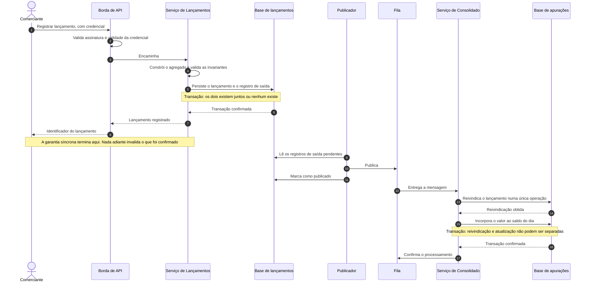
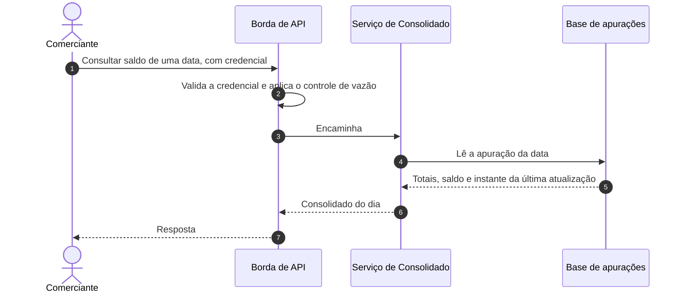
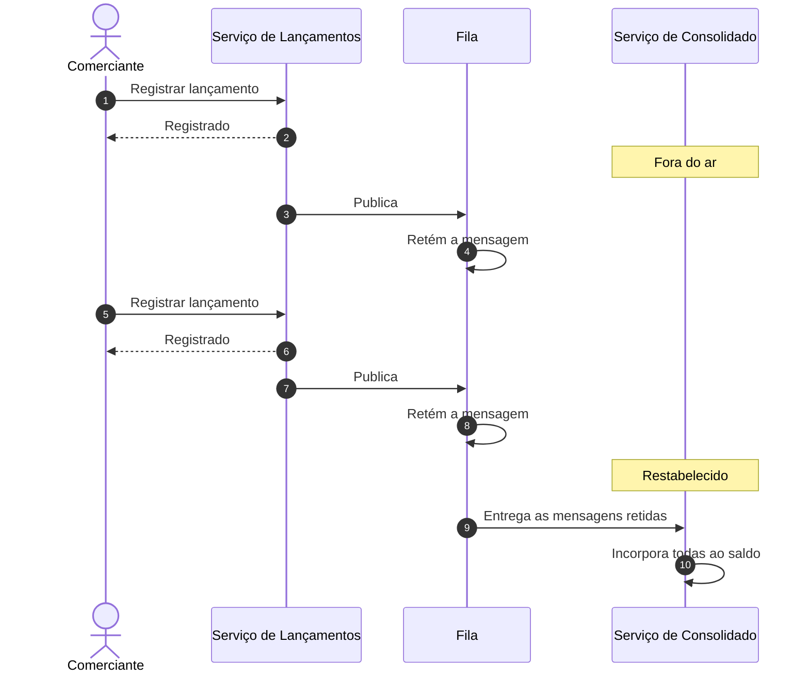
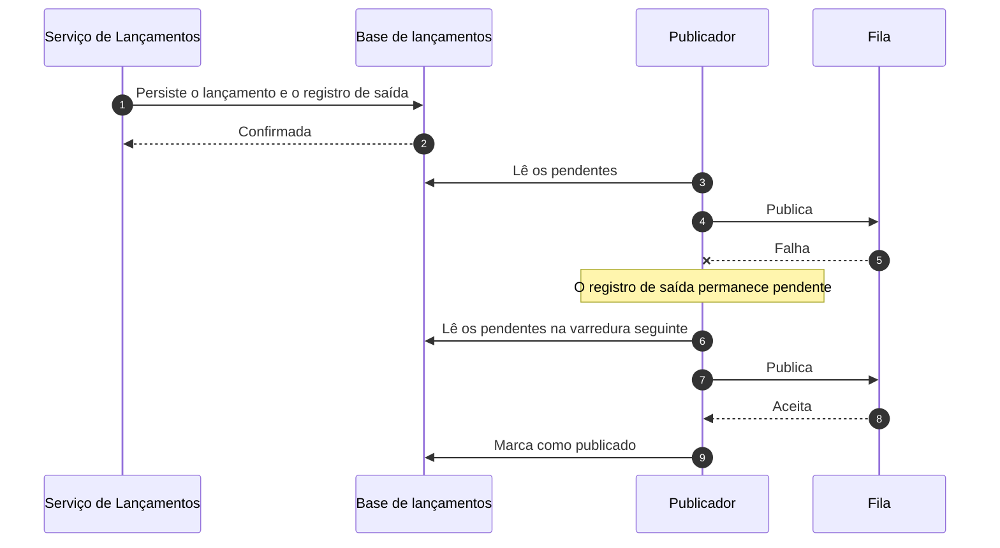
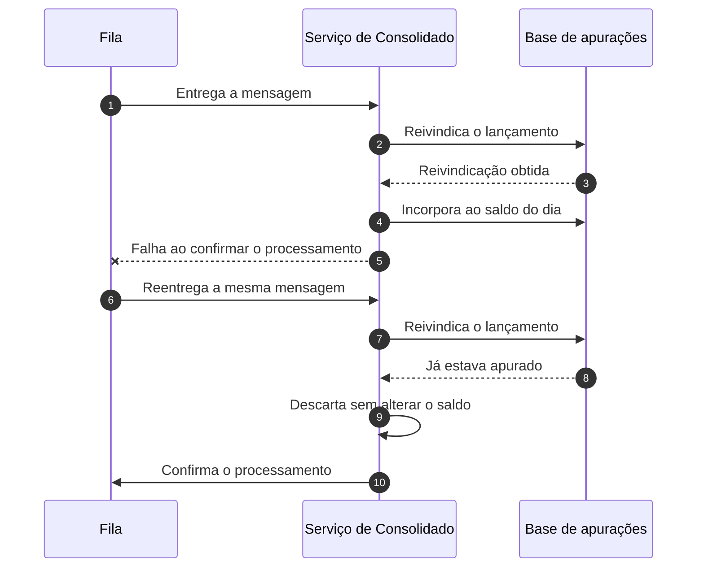

# Fluxo de ponta a ponta e cenários de falha

## Caminho principal

Os dois blocos destacados são transações. O primeiro garante que lançamento e registro de saída existam juntos ou não existam; o segundo garante que a reivindicação do lançamento e a atualização do saldo não possam ser separadas por uma falha.

A reivindicação é **uma** operação, não um par consultar-e-marcar. A razão de não ser um par, e o que aconteceria sob concorrência se fosse, está na [vista de componentes](../arquitetura/vistas/c3-componentes.md).

A confirmação do processamento, no passo final, acontece **depois** da confirmação da transação. A ordem inversa transformaria uma falha em perda.

## Consulta do saldo

Nenhum passo alcança o serviço de Lançamentos ou sua base. É por isso que a consulta continua funcionando com o Lançamentos fora do ar, e é por isso que o custo da consulta não depende do volume de lançamentos do dia.

## Cenários de falha

### O serviço de Consolidado cai

O registro segue funcionando sem degradação. As mensagens acumulam na fila e são entregues no restabelecimento. A consulta do consolidado fica indisponível durante o período, e o saldo converge depois.

Este é o cenário que a especificação exige, e o [ensaio de isolamento de falha](../qualidade/estrategia-de-testes.md) é o que o demonstra.

### A publicação falha após a transação

Sem o registro de saída, este cenário produziria um lançamento confirmado que nunca seria apurado, sem erro visível para ninguém. Com ele, a falha vira atraso: o registro continua pendente e é publicado na varredura seguinte.

O caso de o publicador estar parado, e não apenas lento, é o que o alarme sobre registros pendentes há mais de cinco minutos deveria pegar — e é um dos alarmes especificados em [metas e métricas](../qualidade/metas-e-metricas.md) que ainda não têm métrica que os alimente.

### A mesma mensagem é entregue duas vezes

Reentrega é comportamento normal do transporte, não excepcional. A reivindicação a torna inofensiva: a segunda tentativa não obtém o lançamento, e o saldo não é tocado.

### A base de apurações fica indisponível

O consumidor **suspende o consumo** em vez de continuar puxando mensagens que falhariam. As mensagens permanecem na fila, sem consumir tentativas, e a verificação de prontidão passa a falhar, retirando as tarefas do encaminhamento de leitura sem que sejam reiniciadas — a vivacidade continua respondendo.

Essa distinção é o ponto do cenário. O limite de dez tentativas está calibrado para **mensagem defeituosa**, que falha de forma determinística e não deve bloquear as demais. Aplicá-lo a uma falha de dependência produziria o pior resultado possível: uma indisponibilidade de banco de poucos minutos empurraria a fila inteira para a fila de exceção, e a convergência automática prometida por [RNF-004](../requisitos/transversais/rnf-004-recuperabilidade-e-convergencia-do-consolidado.md) viraria reenvio manual.

Restabelecida a base, o consumo é retomado e o saldo converge sem intervenção.

O registro de lançamentos não é afetado em nenhum momento.

### Uma mensagem é defeituosa

Uma mensagem que viola o contrato de integração falha de forma determinística: reprocessá-la produz o mesmo erro. Após dez tentativas a política de desvio a move para a fila de tratamento de exceção.

As demais mensagens seguem sendo processadas — é para isso que o desvio existe. Reprocessar uma mensagem desviada, corrigida a causa, é seguro pela idempotência — mas **não há operação de reenvio construída**: devolver a mensagem à fila principal é hoje um ato manual sobre o transporte, e o alarme que deveria avisar da primeira ocorrência também não existe. As duas lacunas estão em [RNF-004](../requisitos/transversais/rnf-004-recuperabilidade-e-convergencia-do-consolidado.md) e [RNF-005](../requisitos/transversais/rnf-005-analisabilidade-da-execucao.md).

Este é o único cenário em que a convergência do saldo **exige intervenção**, e é por isso que é o cenário que mais depende de observabilidade que ainda não existe.

### A borda fica indisponível

Os dois serviços tornam-se inalcançáveis. É a contrapartida aceita em [ADR 0007](../decisoes/0007-borda-com-api-gateway-cognito-e-fargate.md) por ter um único ponto de aplicação das políticas de acesso.

O que continua funcionando: as mensagens já publicadas seguem sendo consumidas e o saldo continua sendo apurado, porque esse caminho não passa pela borda.

### A carga excede a capacidade provisionada

O controle de vazão da borda rejeita o excedente de forma explícita e imediata, e as rejeições contam no orçamento de erro, conforme [metas e métricas](../qualidade/metas-e-metricas.md). A razão de rejeitar em vez de deixar a carga saturar os serviços está em [ADR 0007](../decisoes/0007-borda-com-api-gateway-cognito-e-fargate.md).

Este é o único cenário desta página **inteiramente por construir**: a borda não está provisionada, não há controle de vazão em lugar nenhum, e nenhuma requisição é rejeitada por excedente hoje. O que acontece sob sobrecarga, no estado atual, é saturação — exatamente o que o desenho existe para evitar.

## Resumo do comportamento sob falha

| Componente fora do ar | Registrar lançamento | Consultar lançamento | Consultar consolidado | Saldo converge depois |
|---|---|---|---|---|
| Serviço de Consolidado | Funciona | Funciona | Indisponível | Sim |
| Base de apurações | Funciona | Funciona | Indisponível | Sim, sem intervenção |
| Fila | Funciona | Funciona | Funciona, desatualizado | Sim |
| Publicador | Funciona | Funciona | Funciona, desatualizado | Sim |
| Serviço de Lançamentos | Indisponível | Indisponível | Funciona | Não se aplica |
| Base de lançamentos | Indisponível | Indisponível | Funciona | Não se aplica |
| Borda de API | Indisponível | Indisponível | Indisponível | Sim |

As quatro primeiras linhas não contêm indisponibilidade na coluna de registro. São elas que demonstram [RNF-001](../requisitos/transversais/rnf-001-isolamento-de-falha-entre-servicos.md).

A coluna de convergência responde a [RNF-004](../requisitos/transversais/rnf-004-recuperabilidade-e-convergencia-do-consolidado.md): em nenhum cenário de indisponibilidade o saldo permanece divergente, e a convergência dispensa intervenção.

A exceção é a mensagem defeituosa, que não é indisponibilidade e não aparece na tabela: ali a convergência exige reenvio manual da mensagem desviada, pelas razões da seção correspondente.
